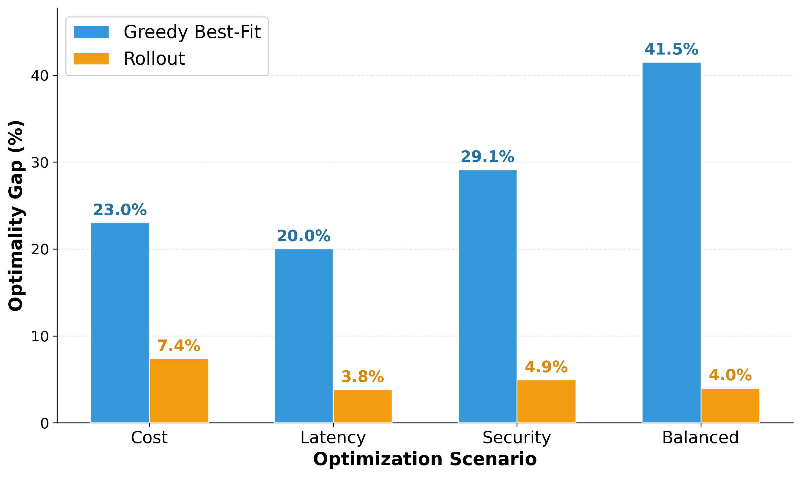
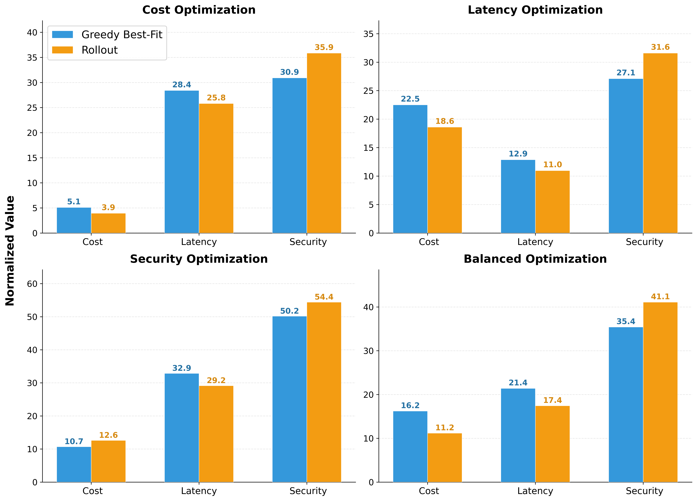
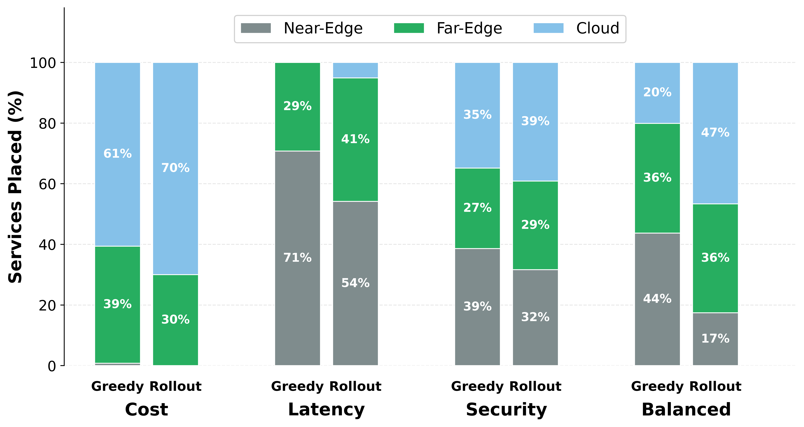
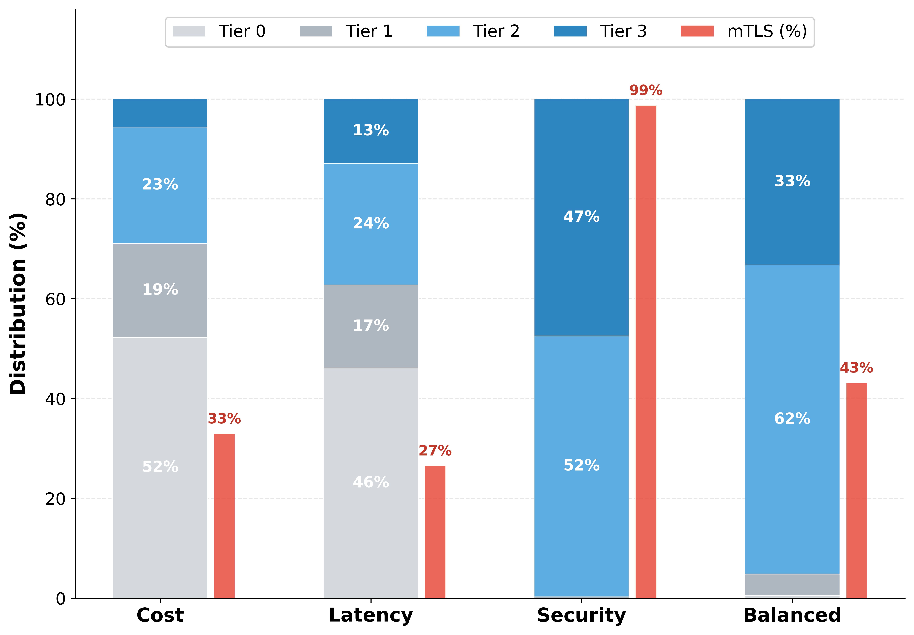
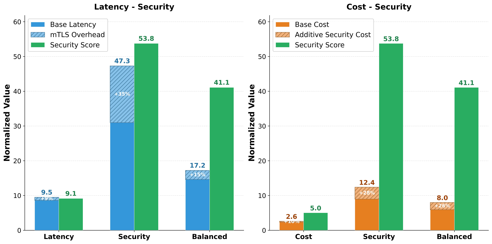

# Initial Experiments

This folder contains all artifacts for **experimental sections 6.2.1. & 6.2.2.**, which evaluate security-aware microservice placement under a **fully collaborative Association** (all orchestration clusters mutually trust each other, i.e., `t_{o,o'} = 1 ∀ o, o'`). Cross-cluster placements therefore do not trigger additional security constraints, enabling a clean evaluation of algorithm performance and security trade-offs.

---


## Config Files

| File | Topology |
| [`config/config.py`](config/config.py) | Basic (22 nodes) 
| [`config/config_big.py`](config/config_big.py) | Extended (90 nodes) 

---

## Experimental Setup Generator

You can generate and preview the experimental setup (topology and workload) using the provided generator script. This script reads the configuration and outputs a summary of the generated infrastructure nodes, clusters, applications, and microservices.

```bash
python generator.py
```

> **Note:** The generator relies on the config files in the `config/` directory and `structs.py` to define the parameters and class structures. You can modify these configuration files to define your custom parameters and then re-run the generator to produce your own experimental setup.

---

## Experiments

### Experiment 1 — Optimality Gap Analysis
**Topology:** Basic | **Config:** `config.py`

Compares the normalised objective scores of Greedy best-fit and the multi-agent Rollout against the optimal ILP (CP-SAT) solution across four optimisation scenarios (cost, latency, security, balanced).


**Plot:** [`results/experiment1_optimality_gap.png`](results/experiment1_optimality_gap.png)  
**Script:** [`results/plot_experiment1.py`](results/plot_experiment1.py)



---


### Experiment 3 — Normalised Metrics Comparison (Extended Scale)
**Topology:** Extended | **Config:** `config_big.py`

Compares Greedy and Rollout across all three normalised objectives (cost, latency, security) on the large topology. No ILP baseline (intractable at this scale).

**Plot:** [`results/experiment3_normalized_metrics.png`](results/experiment3_normalized_metrics.png)  
**Script:** [`results/plot_experiment3.py`](results/plot_experiment3.py)



---

### Experiment 4 — Layer Placement Distribution (Extended Scale)
**Topology:** Extended | **Config:** `config_big.py`

Analyses where microservices are placed (near-edge / far-edge / cloud) for each optimisation scenario, revealing how objective weights shape placement across the continuum.

**Plot:** [`results/experiment4_placement.png`](results/experiment4_placement.png)  
**Script:** [`results/plot_experiment4.py`](results/plot_experiment4.py)



---

### Experiment 5 — Security Tier & mTLS Distribution (Extended Scale)
**Topology:** Extended | **Config:** `config_big.py`

Examines the distribution of assigned security tiers (Tier 0–3) and mTLS link activation across scenarios. Security-optimised placement activates mTLS on ~99% of eligible links.

**Plots:** [`results/experiment5_tiers_mtls.png`](results/experiment5_tiers_mtls.png), [`results/experiment5b_tiers_mtls.png`](results/experiment5b_tiers_mtls.png)  
**Scripts:** [`results/plot_experiment5.py`](results/plot_experiment5.py), [`results/plot_experiment5b.py`](results/plot_experiment5b.py)



---

### Experiment 6 — Security Impact on Cost & Latency (Extended Scale)
**Topology:** Extended | **Config:** `config_big.py`

Quantifies the cost and latency penalty incurred by selecting higher security tiers and enabling mTLS, comparing latency-optimised vs security-optimised placements.


**Plots:** [`results/experiment6_security_impact.png`](results/experiment6_security_impact.png), [`results/experiment6b_security_impact.png`](results/experiment6b_security_impact.png)  
**Scripts:** [`results/plot_experiment6.py`](results/plot_experiment6.py), [`results/plot_experiment6b.py`](results/plot_experiment6b.py)




## How to Reproduce the Plots

```bash
cd results/
python plot_experiment1.py     
python plot_experiment3.py     
# ... etc.
```

> Requires: `matplotlib`, `numpy`
